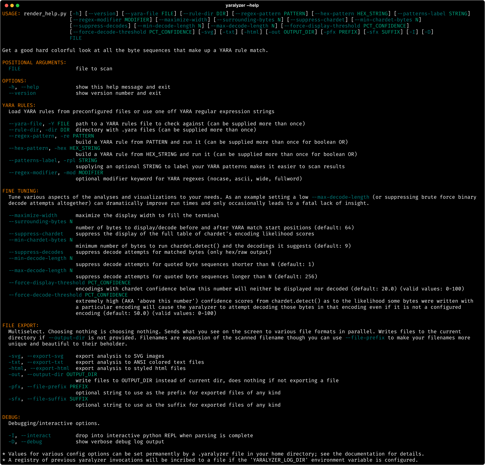
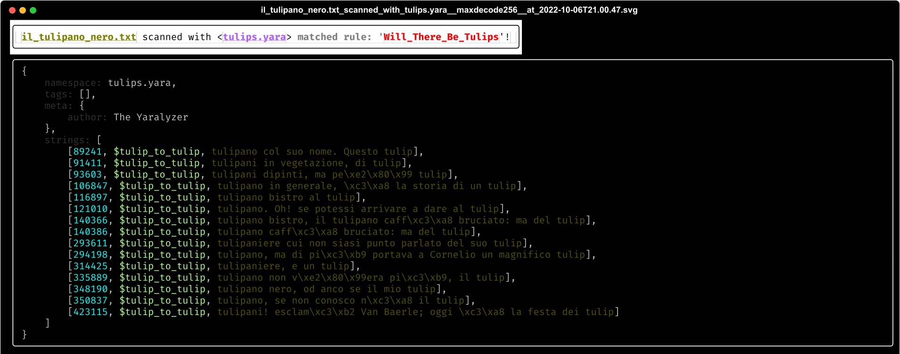

<!--  -->


# THE YARALYZER
Visually inspect all of the regex matches (and their sexier, more cloak and dagger cousins, the [YARA](https://github.com/VirusTotal/yara-python) matches) found in binary data and/or text. See what happens when you force various character encodings upon those matched bytes. [With colors](https://github.com/michelcrypt4d4mus/yaralyzer#example-output).

#### Quick Start
```sh
pipx install yaralyzer

# Scan against YARA definitions in a file:
yaralyze --yara-rules /secret/vault/sigmunds_malware_rules.yara lacan_buys_the_dip.pdf

# Scan against an arbitrary regular expression:
yaralyze --regex-pattern 'good and evil.*of\s+\w+byte' the_crypto_archipelago.exe

# Scan against an arbitrary YARA hex pattern
yaralyze --hex-pattern 'd0 93 d0 a3 d0 [-] 9b d0 90 d0 93' one_day_in_the_life_of_ivan_cryptosovich.bin
```

#### What It Do
1. **See the actual bytes your YARA rules are matching.** No more digging around copy/pasting the start positions reported by YARA into your favorite hex editor. Displays both the bytes matched by YARA as well as a configurable number of bytes before and after each match in hexadecimal and "raw" python string representation.
1. **Do the same for byte patterns and regular expressions without writing a YARA file.** If you're too lazy to write a YARA file but are trying to determine, say, whether there's a regular expression hidden somewhere in the file you could scan for the pattern `'/.+/'` and immediately get a window into all the bytes in the file that live between front slashes. Same story for quotes, BOMs, etc. Any regex YARA can handle is supported so the sky is the limit.
1. **Detect the possible encodings of each set of matched bytes.** [The `chardet` library](https://github.com/chardet/chardet) is a sophisticated library for guessing character encodings and it is leveraged here.
1. **Display the result of forcing various character encodings upon the matched areas.** Several default character encodings will be _forcibly_ attempted in the region around the match. [`chardet`](https://github.com/chardet/chardet) will also be leveraged to see if the bytes fit the pattern of _any_ known encoding. If `chardet` is confident enough (configurable), an attempt at decoding the bytes using that encoding will be displayed.
1. **Export the matched regions/decodings to SVG, HTML, and colored text files.** Show off your ASCII art.

#### Why It Do
The Yaralyzer's functionality was extracted from [The Pdfalyzer](https://github.com/michelcrypt4d4mus/pdfalyzer) when it became apparent that visualizing and decoding pattern matches in binaries had more utility than just in a PDF analysis tool.

[YARA](https://github.com/VirusTotal/yara-python), for those who are unaware[^1], is branded as a malware analysis/alerting tool but it's actually both a lot more and a lot less than that. One way to think about it is that YARA is a regular expression matching engine on steroids. It can locate regex matches in binaries like any regex engine but it can also do far wilder things like combine regexes in logical groups, compare regexes against all 256 XORed versions of a binary, check for `base64` and other encodings of the pattern, and more.  Maybe most importantly of all YARA provides a standard text based format for
people to _share_ their 'roided regexes with the world. All these features are particularly useful when analyzing or reverse engineering malware, whose authors tend to invest a great deal of time into making stuff hard to find.

But... that's also all YARA does. Everything else is up to the user. YARA's just a match engine and if you don't know what to match (or even what character encoding you might be able to match in) it only gets you so far. I found myself a bit frustrated trying to use YARA to look at all the matches of a few critical patterns:

1. Bytes between escaped quotes (`\".+\"` and `\'.+\'`)
1. Bytes between front slashes (`/.+/`). Front slashes demarcate a regular expression in many implementations and I was trying to see if any of the bytes matching this pattern were _actually_ regexes.

YARA just tells you the byte position and the matched string but it can't tell you whether those bytes are UTF-8, UTF-16, Latin-1, etc. etc. (or none of the above). I also found myself wanting to understand what was going _in the region_ of the matched bytes and not just _in_ the matched bytes. In other words I wanted to scope the bytes immediately before and after whatever got matched.

Enter **The Yaralyzer**, which lets you quickly scan the regions around matches while also showing you what those regions would look like if they were forced into various character encodings.

It's important to note that **The Yaralyzer** isn't a full on malware reversing tool. It can't do all the things a tool like [CyberChef](https://gchq.github.io/CyberChef/) does and it doesn't try to. It's more intended to give you a quick visual overview of suspect regions in the binary so you can hone in on the areas you might want to inspect with a more serious tool like [CyberChef](https://gchq.github.io/CyberChef/).

# Installation
Install it with [`pipx`](https://pypa.github.io/pipx/) or `pip3`. `pipx` is a marginally better solution as it guarantees any packages installed with it will be isolated from the rest of your local python environment. Of course if you don't really have a local python environment this is a moot point and you can feel free to install with `pip`/`pip3`.
```
pipx install yaralyzer
```

# Usage
Run `yaralyze -h` to see the command line options (screenshot below).



For info on exporting SVG images, HTML, etc., see [Example Output](#example-output).

### Configuration
If you place a filed called `.yaralyzer` in your home directory or the current working directory then environment variables specified in that `.yaralyzer` file will be added to the environment each time yaralyzer is invoked. This provides a mechanism for permanently configuring various command line options so you can avoid typing them over and over. See the example file [`.yaralyzer.example`](.yaralyzer.example) to see which options can be configured this way.

Only one `.yaralyzer` file will be loaded and the working directory's `.yaralyzer` takes precedence over the home directory's `.yaralyzer`.

### As A Library
[`Yaralyzer`](yaralyzer/yaralyzer.py) is the main class. It has a variety of constructors supporting:

1. Precompiled YARA rules
1. Creating a YARA rule from a string
1. Loading YARA rules from files
1. Loading YARA rules from all `.yara` file in a directory
1. Scanning `bytes`
1. Scanning a file

Should you want to iterate over the `BytesMatch` (like a `re.Match` object for a YARA match) and `BytesDecoder` (tracks decoding attempt stats) objects returned by The Yaralyzer, you can do so like this:

```python
from yaralyzer.yaralyzer import Yaralyzer

yaralyzer = Yaralyzer.for_rules_files(['/secret/rule.yara'], 'lacan_buys_the_dip.pdf')

for bytes_match, bytes_decoder in yaralyzer.match_iterator():
    do_stuff()
```

# Example Output
The Yaralyzer can export visualizations to HTML, ANSI colored text, and SVG vector images using the file export functionality that comes with [Rich](https://github.com/Textualize/rich). SVGs can be turned into `png` format images with a tool like [Inkscape](https://inkscape.org/) or `cairosvg`. In our experience they both work though we've seen some glitchiness with `cairosvg`.

**PyPi Users:** If you are reading this document [on PyPi](https://pypi.org/project/yaralyzer/) be aware that it renders a lot better [over on GitHub](https://github.com/michelcrypt4d4mus/yaralyzer). Pretty pictures, footnotes that work, etc.

#### Raw YARA match result:



#### Display hex, raw python string, and various attempted decodings of both the match and the bytes before and after the match (configurable):


#### Bonus: see what `chardet.detect()` thinks about the likelihood your bytes are in a given encoding/language:


[^1]: As I was until recently.
