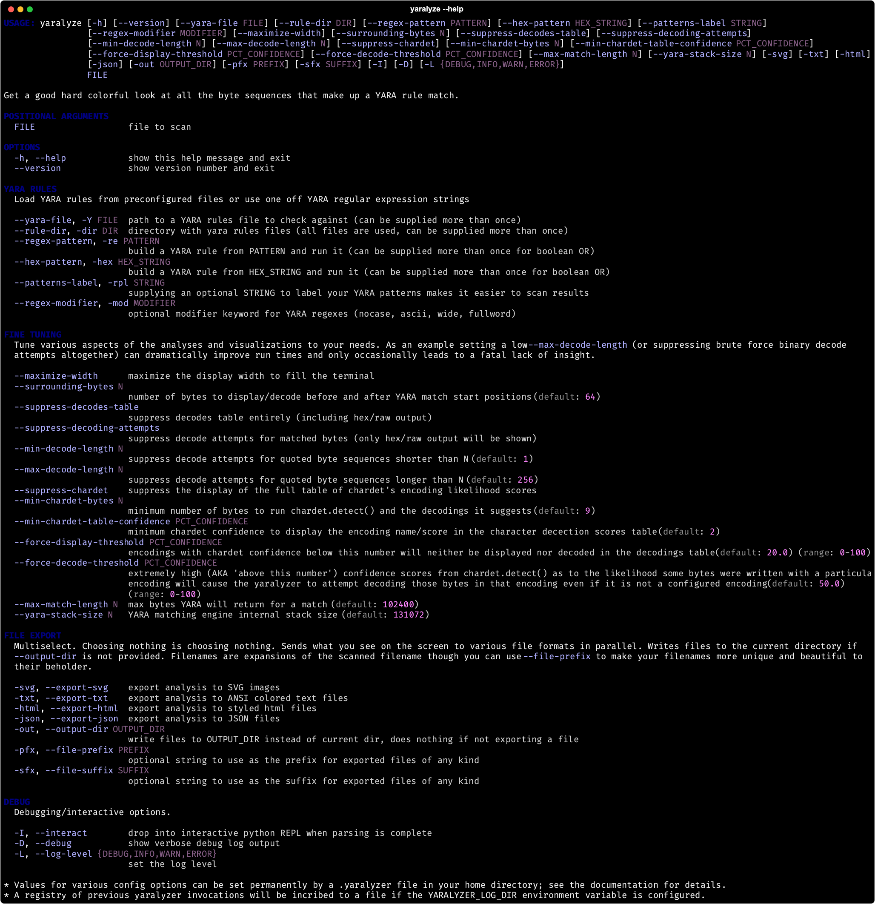

# THE YARALYZER
Visually inspect regex matches and their more cloak and dagger cousins, YARA matches, found in binary data and/or text. See what happens when you force various character encodings upon those matched bytes. [With colors](#example-output).

**PyPi Users:** If you are reading this document [on PyPi](https://pypi.org/project/yaralyzer/) be aware that it renders a lot better [over on GitHub](https://github.com/michelcrypt4d4mus/yaralyzer). Pretty pictures, footnotes that work, etc.

#### Quick Start
```sh
pipx install yaralyzer

# Scan against YARA definitions in a file:
yaralyze --yara-rules /secret/vault/sigmunds_malware_rules.yara lacan_buys_the_dip.pdf

# Scan against an arbitrary regular expression:
yaralyze --regex-pattern 'good and evil.*of\s+\w+byte' the_crypto_archipelago.exe
```

#### What It Do
1. **See the actual bytes your YARA rules are matching.** No more digging around copy/pasting the start positions reported by YARA into your favorite hex editor. Displays both the bytes matched by YARA as well as a configurable number of bytes before and after each match.
1. **Display bytes matching arbitrary regular expressions.** If, say, you were trying to determine whether there's a regular expression hidden somewhere in the file you could scan for the pattern `'/.+/'` and immediately get a window into all the bytes in the file that live between front slashes. Same story for quotes, BOMs, etc. - sky's the limit.
1. **Display the result of forcing various character encodings upon the matched areas.** Several default character encodings will be _forcibly_ attempted in the region around the match. [The `chardet` library](https://github.com/chardet/chardet) will also be leveraged to see if the bytes fit the pattern of _any_ known encoding. If `chardet` is confident enough (configurable), the decoding will be displayed.
1. **Export the matched regions/decodings to SVG, HTML, and colored text files.** Show off your ASCII art.

#### Why It Do

The Yaralyzer's functionality was extracted from [The Pdfalyzer](https://github.com/michelcrypt4d4mus/pdfalyzer) when it became apparent that visualizing and decoding pattern matches in binaries had more utility than just in a PDF analysis tool.

# Example Output
The Yaralyzer can export visualizations to HTML, ANSI colored text, and SVG vector images using the file export functionality that comes with [Rich](https://github.com/Textualize/rich). SVGs can be turned into `png` format images with a tool like `inkscape` or `cairosvg` (Inkscape works a lot better in our experience).


Bonus: see what `chardet.detect()` thinks about your bytes. It estimates how likely a given chunk of bytes is in a given encoding while also guessing the language.


# Usage
Run `yaralyzer -h` to see the command line options. Currently they are as follows:


